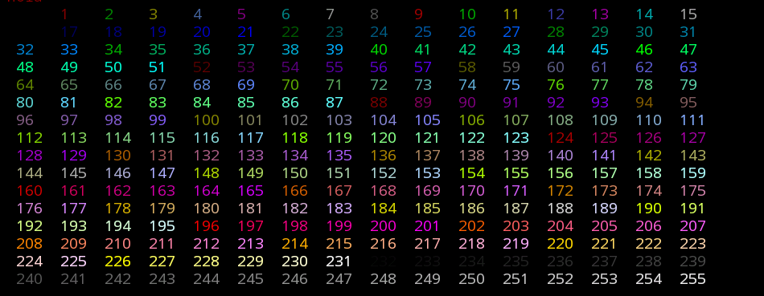
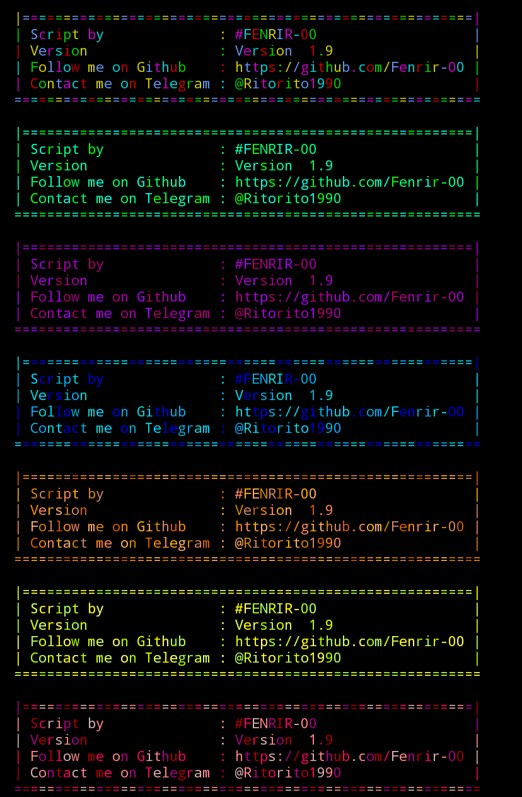

# colores

# ejemplos
print(f"{color.n15}hola mundo")
print(f"color.n127}hola mundo")
# funciones
colorclasic("hola mundo")
colorverde("hola mundo")
colormorado("hola mundo")
colorazul("hola mundo")
colornaraja("hola mundo")
coloramarillo("hola mundo")
colorrojo("hola mundo")

